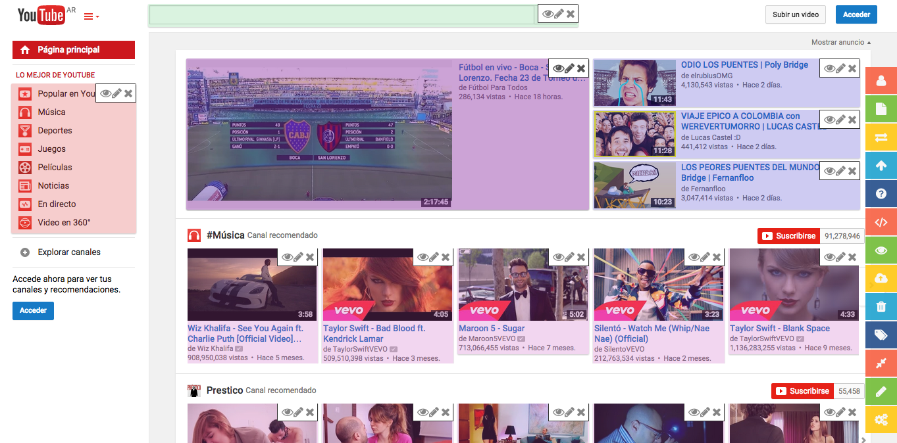
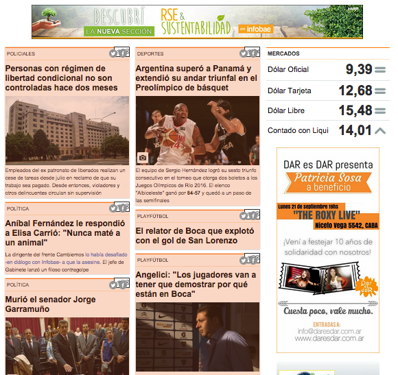
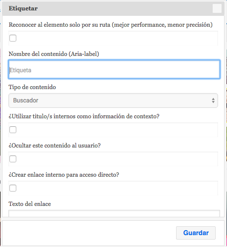
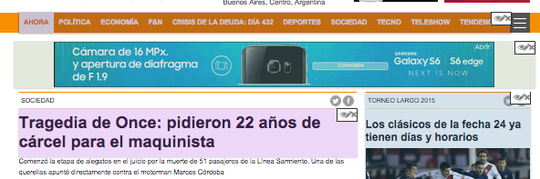
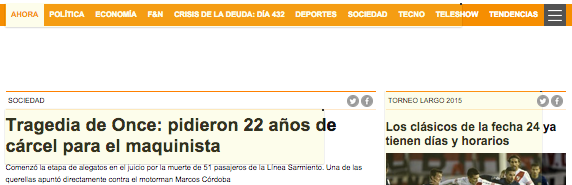

# Web Accesibility Transcoder 

####This is a University project that I'm working on.
####Code will be uploaded as soon I reach to an stable version.

##General description

It's about a Javascript application that provides an Accesibility Toolbar.
This toolbar allows users to tag elements on the web and add some extra semantic information about what they are selecting.

By doing this, users are able to construct templates for accesibility purposes.

The main idea is to generate a crowdsourcing platform, where users can contribute on the creation of accesibility templates that will be downloaded by disabled users in order to asist them during the navigation process.

We will be able to increase Accesbility in web applications, even if we are not owners of the website: Just create a template, and share it.

##Modes

The application consists in two modes:
<ul>
	<li>An <b>edition</b> mode that displays the toolbar for creating templates</li>
	<li>A <b>player</b> mode that downloads the templates available for the current domain</li>
</ul>

##Goals

The finals goals of generating templates by using this application are:

<ul>
	<li>Transcode all the visual information that blind users can't access into a more accesible format, by adding better descriptions and roles to the website's elements</li>
	<li>Improve the usability of screen readers</li>
	<li>Hide/remove elements that are not relevant for website (like publicity)</li>
	<li>Change elements tabindex order</li>
	<li>Create internal links that allow to jump directly to the content</li>
	<li>Map the full web navigation process to only a few keys, in order to help physically disabled users that require of the use of special joysticks</li>
</ul>

## Examples

A toolbar will be displayed on the right side of the website. 
 

Users will be able to group some elements inside the website once and then the tool will automaticaly detect whether there exist the same element pattern in another part of the website. So you only need to tag once and then the semantic information will by applied to all the elements that are similar (this feature can be avoided if wanted). This is achieved thanks to a similarity algorithm that I've developed.
 

After the selection of an element, a form will be displayed asking for semantic information and some other features.
 

For example, we can tag an element that we don't want to be displayed like this publicity.
 

And then it not will be displayed to disabled users.
 

